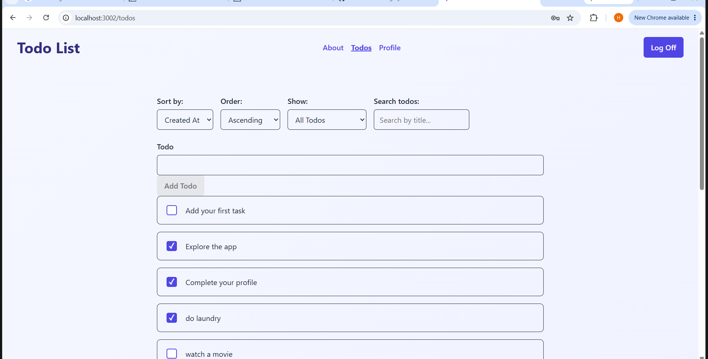
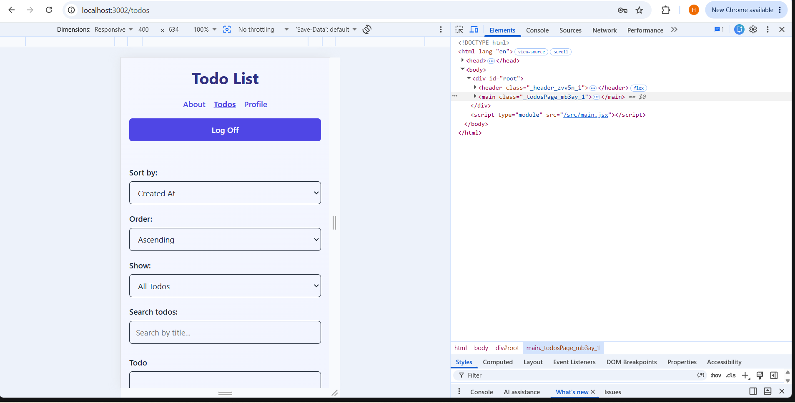

# Todo List 2

Todo List 2 is a React application that allows authenticated users to create, manage, filter, sort, and track their todos. The project was built as part of the Code The Dream React curriculum and demonstrates React fundamentals, routing, authentication, API integration, state management, responsive design, and input validation.

## Features

- User authentication and protected routes
- Add new todos
- Edit existing todos
- Mark todos as completed
- Filter todos by status
- Search todos by title
- Sort todos
- View todo statistics on the profile page
- Input validation and maximum character limits
- Loading, error, and empty states
- Responsive design for desktop, tablet, and mobile devices
- Accessible form labels, focus indicators, and touch-friendly controls

## Technologies Used

- React
- JavaScript
- React Router
- CSS Modules
- Vite
- REST API
- ESLint
- Git and GitHub

## Screenshots

### Desktop



### Mobile


## Installation

Clone the repository and install the project dependencies:

```bash
npm install
```

## Run the Development Server

```bash
npm run dev
```

## Available Scripts

### Development

```bash
npm run dev
```

Starts the Vite development server.

### Build

```bash
npm run build
```

Creates a production build of the application.

### Preview

```bash
npm run preview
```

Previews the production build locally.

### Lint

```bash
npm run lint
```

Checks the project for linting issues.

## Design Decisions

The application uses CSS Modules to keep component styles organized and scoped. A consistent color scheme, spacing system, typography hierarchy, and button styling are used throughout the application.

The interface was designed to work across desktop, tablet, and mobile screen sizes. Todo items use custom checkbox styling to clearly distinguish active and completed tasks, while focus and hover states provide feedback for keyboard and mouse users.

Reusable components are used for shared interface elements such as navigation, form controls, filtering, and sorting. React Context manages authentication, while `useReducer` manages Todo state and optimistic updates.

## Future Improvements

Future improvements could include:

- Additional profile customization
- More advanced todo organization and categories
- Due dates and priority levels
- Additional filtering and sorting options
- Expanded accessibility testing

## License

This project was created for educational purposes as part of the Code The Dream React curriculum.

## Contact

Heather Smith  
GitHub: Heather813903